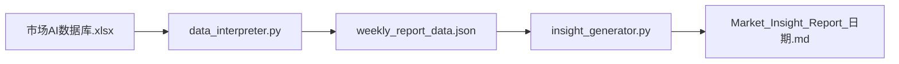

# Market AI / 市场AI数据库

从 Excel 市场数据库读取多资产指标，按周度聚合并计算三年滚动分位数，进行 Z-Score 与周度波动异动检测，并调用 DeepSeek 大模型生成宏观战略推演报告。面向战略研究岗、宏观与市场分析场景。

## 工作流程



## 项目结构

| 文件 | 说明 |
|------|------|
| `data_interpreter.py` | 周度聚合、分位数计算、异动检测、三张固定双轴图 |
| `insight_generator.py` | DeepSeek API 调用与周度报告生成 |
| `市场AI数据库.xlsx` | 数据源（需自行放置） |
| `.env` | API Key 配置（需自行创建） |
| `weekly_report_data.json` | 市场水位、本周边际异动、图表路径（自动生成） |
| `charts/` | 固定双轴图与异动走势图（自动生成） |
| `Market_Insight_Report_*.md` | 周度战略报告 Markdown（自动生成） |
| `Market_Insight_Report_*.pdf` | 周度战略报告 PDF（需 wkhtmltopdf） |

## 环境要求

- Python 3.10+
- 依赖：pandas, numpy, openai, python-dotenv, openpyxl, matplotlib, markdown, pdfkit
- PDF 生成需系统安装 [wkhtmltopdf](https://wkhtmltopdf.org/)（可选，未安装时自动降级为 Markdown）

## 安装

```bash
# 克隆或下载项目后
cd Market_AI_Project

# 创建虚拟环境（推荐）
python -m venv .venv
.venv\Scripts\activate   # Windows
# source .venv/bin/activate  # Linux/macOS

# 安装依赖
pip install -r requirements.txt
```

## 配置

1. **API Key**：复制 `.env.example` 为 `.env`，填入 DeepSeek API Key：
   ```
   DEEPSEEK_API_KEY=sk-your-api-key-here
   ```
   在 [DeepSeek 开放平台](https://platform.deepseek.com/) 创建并获取 Key。

2. **数据源**：将 `市场AI数据库.xlsx` 置于项目根目录。

## 使用方法

```bash
# 步骤 1：扫描数据，周度聚合，生成市场水位与异动清单
python data_interpreter.py

# 步骤 2：调用 DeepSeek 生成周度战略推演报告（单页 PDF/Markdown）
python insight_generator.py
```

**盘后自动运行**：使用 `run_market_ai.bat`，建议在 Windows 任务计划程序中设置为**每周五 18:00** 执行，报告将自动复制到桌面。

## 数据源说明

支持的 Excel Sheet：

- 债券指数、DR001收盘价、VIX、债券收益率
- 石油价格、黄金价格
- 同业拆借利率、美元指数&人民币汇率
- 融资融券余额及买入占比、散户情绪资金流向、A股交易量

数据需包含日期列与数值列，具体结构见 `data_interpreter.py` 中各 `_clean_*` 函数。

## 输出示例

**weekly_report_data.json**：市场基础水位（含三年分位数）、本周边际异动、固定双轴图路径。

**Market_Insight_Report_*.md**：宏观坐标判断、边际变化推演、战略研判。

## 注意事项

- `.env` 已加入 .gitignore，切勿提交 API Key。
- Excel 文件需持续更新以保持检测有效性。
